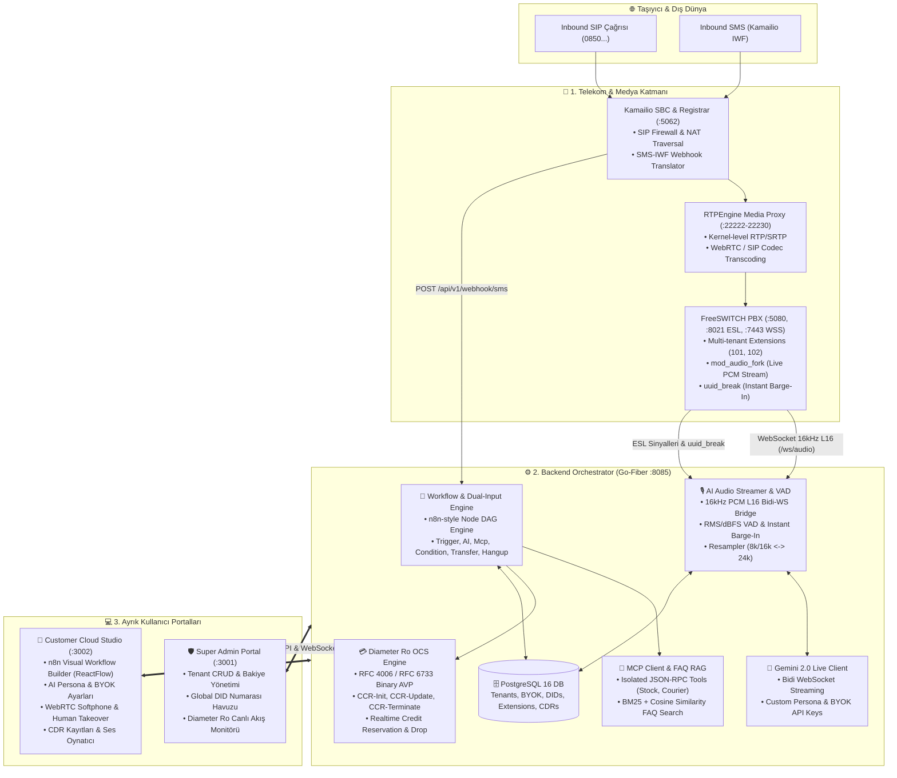

# 📡 AI Call Center & Carrier-Grade Orchestrator
## 🏛️ Kapsamlı Sistem Mimarisi ve Teknik Dokümantasyon

> **Yazar / Lisans Sahibi:** Tarık Öğüt (`tarik@icell.cloud`)  
> **Platform:** [icell.cloud](https://icell.cloud)  
> **Sürüm:** v2.5 Carrier-Grade Multi-Tenant CPaaS  
> **Tarih:** Ekim 2026  

---

## 📌 İçindekiler
1. [Genel Bakış & Tasarım İlkeleri](#1-genel-bakış--tasarım-ilkeleri)
2. [Sistem Mimarisi Diyagramı](#2-sistem-mimarisi-diyagramı)
3. [Katmanlar ve Bileşen Detayları](#3-katmanlar-ve-bileşen-detayları)
   - [3.1 Telekom ve Medya Katmanı (SBC / PBX)](#31-telekom-ve-medya-katmanı-sbc--pbx)
   - [3.2 Backend Orchestrator Katmanı (Go-Fiber)](#32-backend-orchestrator-katmanı-go-fiber)
   - [3.3 Ayrık Web Portalları (Super Admin & Customer Studio)](#33-ayrık-web-portalları-super-admin--customer-studio)
4. [Uçtan Uca Çağrı ve Veri Akışı](#4-uçtan-uca-çağrı-ve-veri-akışı)
5. [Gerçek Zamanlı AI Ses Akışı, VAD & Barge-In Mekanizması](#5-gerçek-zamanlı-ai-ses-akışı-vad--barge-in-mekanizması)
6. [Diameter Ro (3GPP / RFC 4006) Online Charging System (OCS)](#6-diameter-ro-3gpp--rfc-4006-online-charging-system-ocs)
7. [Çoklu Kiracı (Multi-Tenancy) ve İzolasyon Modeli](#7-çoklu-kiracı-multi-tenancy-ve-izolasyon-modeli)
8. [Docker Konteyner & Port Dağılım Tablosu](#8-docker-konteyner--port-dağılım-tablosu)

---

## 1. Genel Bakış & Tasarım İlkeleri

Platform; telekom operatörü standartlarında çalışan, çoklu kiracı (multi-tenant) destekli, yapay zeka sesli asistanları (Google Gemini 2.0 Live) ile görsel iş akışı (n8n stili) motorunu ve canlı faturalandırma (Diameter Ro OCS) altyapısını bir araya getiren yeni nesil bir **İletişim Platformu (CPaaS)** çözümüdür.

### Temel Prensipler:
- **Çift Giriş (Dual-Input):** Aynı iş akışı motoru hem **Sesli Arama (Call)** hem de **SMS** kanallarını karşılar.
- **Ultra Düşük Gecikme (Low Latency):** Ham PCM L16 ses akışı doğrudan WebSocket üzerinden taşınır.
- **Kesintisiz Araya Girme (Barge-In):** Müşteri konuştuğu anda yapay zeka milisaniyeler içinde susar ve dinlemeye geçer.
- **Kesin İzolasyon:** Her firmanın (Tenant) kendi BYOK API anahtarları, dahili hatları, DID numaraları, MCP sunucuları ve FAQ veri setleri tamamen bağımsızdır.
- **Ayrık Portallar:** Operatör için Super Admin (`:3001`) ve Kiracı için Customer Studio (`:3002`) bağımsız web uygulamaları olarak koşar.

---

## 2. Sistem Mimarisi Diyagramı



---

## 3. Katmanlar ve Bileşen Detayları

### 3.1 Telekom ve Medya Katmanı (SBC / PBX)
- **Kamailio SBC (`callcenter-kamailio`):**
  - Taşıyıcı operatörden gelen SIP trafiğini karşılar, IP/Port güvenliğini sağlar ve NAT arkasındaki istemcileri yönetir.
  - Çoklu kiracı alan adı yönlendirmesini (`101@eczane_hayat`, `201@jet_kargo`) yapar.
  - **SMS-IWF Modülü:** Operatörden gelen SMS mesajlarını yakalayarak Orchestrator'ın `POST /api/v1/webhook/sms` adresine JSON formatında iletir.
- **RTPEngine (`callcenter-rtpengine`):**
  - Linux çekirdek düzeyinde yüksek performanslı RTP proxying sağlar.
  - WebRTC (SRTP/DTLS) ile klasik santral (RTP) arasındaki medya şifreleme ve port çevrimlerini gerçekleştirir.
- **FreeSWITCH PBX (`callcenter-freeswitch`):**
  - Müşterilere ait dahili hatların (`101`, `102`...) SIP/WebRTC kaydını tutar.
  - **`mod_audio_fork`:** Gelen ses çağrısını anlık olarak yakalayıp 16.000 Hz saf L16 PCM formatında Go backend'in `/ws/audio` WebSocket ucuna çift yönlü köprüler.
  - **`uuid_break`:** Müşteri araya girdiğinde (Barge-In) FreeSWITCH üzerindeki ses çalma tamponunu anında temizler.

---

### 3.2 Backend Orchestrator Katmanı (Go-Fiber)
Tüm iş mantığını, yapay zekayı ve telekom sinyalleşmesini yöneten yüksek performanslı Go servisi:
- **İş Akışı Motoru (`pkg/workflow/`):**
  - n8n benzeri JSON tabanlı Node DAG (Directed Acyclic Graph) yapısını çalıştırır.
  - `CALL` ve `SMS` kanalları için ortak çalışır.
  - Blok Tipleri: `InboundTrigger`, `AiAgentNode`, `McpToolNode`, `ConditionNode`, `TransferNode`, `SmsReplyNode`, `DiameterRatingNode`, `HangupNode`.
- **Gerçek Zamanlı AI & Ses Streaming (`pkg/ai/`):**
  - `audio_streamer.go`: FreeSWITCH'ten gelen ses paketlerini kuyruklar, VAD motorundan geçirir ve Gemini'ye iletir.
  - `vad.go`: Ses sinyallerinin RMS ve dBFS değerlerini hesaplar. Konuşma başladığında anında `barge-in` bayrağını kaldırır.
  - `gemini_live.go`: Google Gemini 2.0 Multimodal Live WebSocket protokolünü yönetir (session setup, realtime input, server turnaround).
  - `resample.go`: 16kHz (Telefoni) ile 24kHz (Gemini) arasındaki 2:3 ve 3:2 örnekleme frekansı dönüşümünü yapar.
- **Entegrasyon Motorları (`pkg/mcp/`, `pkg/rag/`):**
  - `mcp`: JSON-RPC 2.0 protokolüyle harici araçları (stok sorgulama, kargo takip vb.) çağırır.
  - `rag`: Kiracının yüklediği Soru-Cevap (FAQ) verilerinde BM25 ve Kosinüs Benzerliği (Cosine Similarity) ile anlamsal arama yapar.
- **Diameter Ro OCS Faturalandırma (`pkg/diameter/`):**
  - 3GPP TS 32.299 standartlarında ikili (binary) AVP kodlama/çözme motoru.
  - Çağrı süresince canlı bakiye rezervasyonu ve düşümü yapar. Bakiye bittiğinde santrale çağrıyı sonlandırma emri iletir.
- **Veritabanı Katmanı (`pkg/db/`):**
  - PostgreSQL 16 (SQLite fallback). Tenant, Extension, DID, Workflow, TenantSettings (BYOK, Persona, FAQ), CDR tablolarını yönetir.

---

### 3.3 Ayrık Web Portalları (Super Admin & Customer Studio)

İki bağımsız frontend uygulaması ve bağımsız portlar:

#### A. Super Admin Portal (`ui-admin` • Port: 3001)
- **Hedef Kitle:** Telekom Operatörü / Santral Sahibi.
- **Özellikler:**
  - **Tenant Yönetimi:** Yeni müşteri/firma oluşturma, askıya alma/aktif etme, maksimum eşzamanlı çağrı kotası belirleme, aylık harcama limiti ve başlangıç bakiyesi yükleme.
  - **Global DID Havuzu:** Taşıyıcıdan alınan `0850...` coğrafi/konumdan bağımsız numaraları yönetme ve firmalara tahsis etme.
  - **Diameter Ro Canlı Akışı:** Gerçekleşen CCR-Init/Update/Terminate mesajlarını ve canlı şarj trafiğini izleme.

#### B. Customer Cloud Studio (`ui-customer` • Port: 3002)
- **Hedef Kitle:** Hizmeti satın alan Kurumsal Müşteri / Firma (Örn: *Hayat Eczanesi*, *Jet Kargo*).
- **Özellikler:**
  - **Görsel Workflow Builder:** ReactFlow tabanlı sürükle-bırak n8n stili akış düzenleyici.
  - **AI Persona & BYOK:** Kendi Gemini API anahtarını tanımlama, yapay zekaya isim/karakter verme, dolgu kelimeleri ayarlama.
  - **MCP & FAQ Yönetimi:** Kendi harici API/araçlarını bağlama ve sık sorulan soruları yükleme.
  - **Dahili Hatlar (Extensions):** `101`, `102` dahili SIP/WebRTC kullanıcılarını yönetme.
  - **WebRTC Softphone & Human Takeover:** Temsilcinin tarayıcı üzerinden çağrı yanıtlaması veya yapay zekadan canlı olarak çağrıyı tek tıkla devralması.
  - **CDR & Ses Kayıtları:** Geçmiş çağrıların süre, maliyet, ses dalgası ve deşifre kayıtları.

---

## 4. Uçtan Uca Çağrı ve Veri Akışı

```
[Arayan Müşteri]              [Kamailio / FreeSWITCH]              [Orchestrator Backend]              [Gemini 2.0 Live]
       │                                │                                    │                                  │
       ├─── 1. SIP INVITE (0850...) ───►│                                    │                                  │
       │                                ├─── 2. Auth & Route Query ─────────►│ (Diameter CCR-Init Kredi Rezerve)│
       │                                │◄─── 3. 200 OK (Quota Granted) ────┤                                  │
       │◄── 4. 200 OK / Call Answered ──┤                                    │                                  │
       │                                │                                    │                                  │
       │                                ├─── 5. AudioFork WS Bağlantısı ────►│                                  │
       │                                │    (16kHz L16 PCM Akışı)           ├─── 6. Bidi Live WS Session ─────►│
       │                                │                                    │    (Setup with Custom Persona)   │
       │                                │                                    │                                  │
       ├─── 7. "Nöbetçi misiniz?" ─────►│=== (PCM Sesi Forward Edilir) =====►│=== (24kHz Resample Edilir) =====►│
       │                                │                                    │                                  │
       │                                │                                    │◄── 8. AI Ses Yanıtı (L16) ──────┤
       │◄── 9. AI Sesi Dinletilir ──────│◄== (FreeSWITCH Playback) ══════════┤                                  │
       │                                │                                    │                                  │
       ├─── 10. [BARGE-IN] "Peki..." ──►│                                    │                                  │
       │    (Araya girme konuşması)     ├─── (PCM Ses Enerjisi Yükselir) ───►│                                  │
       │                                │                                    ├─► [VAD: RMS > Eşik Değeri!]      │
       │                                │◄── 11. ESL: "uuid_break" ──────────┼─► [Cancel Gemini Audio Playback] │
       │ (AI Sesi Anında Kesilir!)      │    (Tamponu anında temizle)        │                                  │
       │                                │                                    │                                  │
       ├─── 12. "Yetkiliye aktarın" ───►│                                    ├─── 13. TransferNode Tetiklenir   │
       │                                │◄── 14. Dialplan: bridge(user/101) ─┤    (Canlı Temsilciye Aktar)      │
       │                                ├─── 15. WebRTC SIP INVITE ─────────┼──────────────────────────────────► [Müşteri Masası]
       │◄══ 16. Canlı Temsilci ile Çağrı Devam Eder ═════════════════════════╬══════════════════════════════════► (Softphone: 101)
       │                                │                                    │                                  │
       ├─── 17. Çağrı Sonlandırılır ───►│                                    │                                  │
       │                                ├─── 18. Hangup Event (ESL) ────────►│ (Diameter CCR-Terminate)        │
       │                                │                                    │ • Bakiye Düşümü Gerçekleşir      │
       │                                │                                    │ • CDR Kaydı Veritabanına Yazılır │
```

---

## 5. Gerçek Zamanlı AI Ses Akışı, VAD & Barge-In Mekanizması

- **Örnekleme Hızı Köprüsü (`pkg/ai/resample.go`):**
  - FreeSWITCH telekomünikasyon standardı olarak `16.000 Hz, 16-bit Mono Little-Endian PCM` akıtır.
  - Gemini 2.0 Live API ise `24.000 Hz PCM` bekler ve üretir.
  - Resampler modülü 3:2 yukarı (up-sampling) ve 2:3 aşağı (down-sampling) oranlarında kayıpsız lineer enterpolasyon uygular.
- **Ses Aktivite Tespiti (VAD - `pkg/ai/vad.go`):**
  - Gelen 20 milisaniyelik ses karelerinin RMS (Root Mean Square) genliği ve dBFS seviyesi anlık hesaplanır.
  - Eşik değeri (-35 dBFS / RMS ~1000) aşıldığında konuşma durumu `SpeechStateSpeaking` yapılır.
- **Barge-In (Kesinti Protokolü):**
  - Yapay zeka karşı tarafa ses çalarken (`isAIPlaying = true`), kullanıcı konuşmaya başladığı anda VAD bunu 20ms içinde algılar.
  - Go motoru playback kuyruğunu (`playbackQueue`) temizler, Gemini'ye kesinti bildirimi yapar ve FreeSWITCH Event Socket üzerinden `uuid_break <uuid> all` emri yollar. Karşı tarafın duyduğu AI sesi sıfır gecikmeyle susar.

---

## 6. Diameter Ro (3GPP / RFC 4006) Online Charging System (OCS)

Telekom operatör standartlarında kredi ve kontör yönetimi:
- **Paket Yapısı (`pkg/diameter/packet.go`):**
  - Standart Diameter Başlığı (20 bayt): Versiyon, Mesaj Uzunluğu, Komut Kodu (`272 - Credit-Control`).
  - Standart AVP'ler: `Session-Id (263)`, `Origin-Host (264)`, `Origin-Realm (266)`, `CC-Request-Type (416)`, `CC-Request-Number (415)`, `Subscription-Id (443)`, `Used-Service-Unit (446)`.
- **Şarj Durum Makinesi:**
  1. **CCR-INITIAL (1):** Çağrı bağlandığında gönderilir. Kiracının bakiyesinden tahmini süre için (örn. 60 sn) kredi rezerve edilir. Bakiye yoksa çağrı düşürülür.
  2. **CCR-UPDATE (2):** Çağrı devam ettiği sürece her dakika rezerve güncellenir ve harcanan miktar teyit edilir.
  3. **CCR-TERMINATION (3):** Çağrı kapandığında kesinleşen süre ve tutar tahsil edilir, harcanmayan rezervasyon kiracının bakiyesine anında iade edilir.
  4. **CCR-EVENT (4):** Tek seferlik SMS gönderimleri için anlık bakiye düşümü yapar.

---

## 7. Çoklu Kiracı (Multi-Tenancy) ve İzolasyon Modeli

Veritabanında ve çalışma anında her kiracı katı bir şekilde izoledir:

| Parametre | İzolasyon Seviyesi | Açıklama |
| :--- | :--- | :--- |
| **BYOK (Bring Your Own Key)** | Kiracı Başına Özel | Her işletme kendi Gemini/OpenAI API anahtarını kullanır. Bir kiracının kotası diğerini etkilemez. |
| **Persona & Prompt** | Kiracı Başına Özel | Eczane için *"Ayşe"*, Kargo için *"Can"* vb. karakterler, karşılama ve dolgu kelimeleri izoledir. |
| **MCP Sunucuları** | Kiracı Başına Özel | Her firmanın bağlandığı stok veya CRM servis URL'si ve yetkileri bağımsızdır. |
| **FAQ RAG Havuzu** | Kiracı Başına Özel | A firmasının sıkça sorulan soruları B firmasının sorgularında asla çıkmaz. |
| **Dahili Hatlar (Extensions)** | Kiracı Domaini | `101@eczane_hayat` ile `101@jet_kargo` aynı santralde birbirine karışmadan çalışır. |
| **DID Numaraları** | Benzersiz Tahsis | Operatör DID havuzundan kiracıya özel atanan `0850...` hatları sadece o kiracının akışını tetikler. |

---

## 8. Docker Konteyner & Port Dağılım Tablosu

Sistem `docker-compose.yml` üzerinden tek komutla ayağa kaldırılabilen 7 adet optimize edilmiş konteynerden oluşur:

| Konteyner Adı | Servis / İmaj | Dış Port (Host) | İç Port (Container) | Görevi |
| :--- | :--- | :--- | :--- | :--- |
| **`callcenter-admin-ui`** | Nginx SPA (`ui-admin`) | **`3001`** | `80/tcp` | Süper Admin Operatör Portalı |
| **`callcenter-customer-ui`**| Nginx SPA (`ui-customer`)| **`3002`** | `80/tcp` | Müşteri Cloud Studio & Softphone |
| **`callcenter-orchestrator`**| Go 1.24 (`cmd/server`) | **`8085`** | `8080/tcp` | Fiber API, AudioFork WS, OCS, Flow Engine |
| **`callcenter-postgres`** | PostgreSQL 16 Alpine | **`5432`** | `5432/tcp` | Çoklu kiracı ilişkisel veritabanı |
| **`callcenter-kamailio`** | Kamailio CI SBC | **`5062`** | `5060/tcp+udp` | SIP Giriş Kapısı, Registrar & SMS-IWF |
| **`callcenter-freeswitch`** | FreeSWITCH Latest | **`5080`, `8021`, `7443`**| `5080`, `8021`, `7443` | Medya Sunucusu, ESL, WebRTC SIP |
| **`callcenter-rtpengine`** | Jambonz RTPEngine | **`22222-22230`** | `22222-22230/udp` | Kernel RTP/SRTP Medya Köprüsü |

---

## 🛠️ Başlatma ve Doğrulama

```bash
# Bütün altyapıyı derle ve arka planda ayağa kaldır
docker compose up -d --build

# Konteynerların sağlığını kontrol et
docker ps

# Süper Admin Paneli:      http://localhost:3001
# Müşteri Tasarım Stüdyosu: http://localhost:3002
# REST API Health Check:    http://localhost:8085/healthz
```

---
*Dokümantasyon [ai-callcenter-orchestrator](https://github.com/tarikogut/ai-callcenter-orchestrator.git) deposunda `docs/ARCHITECTURE.md` dosyasında güncel olarak saklanmaktadır.*
